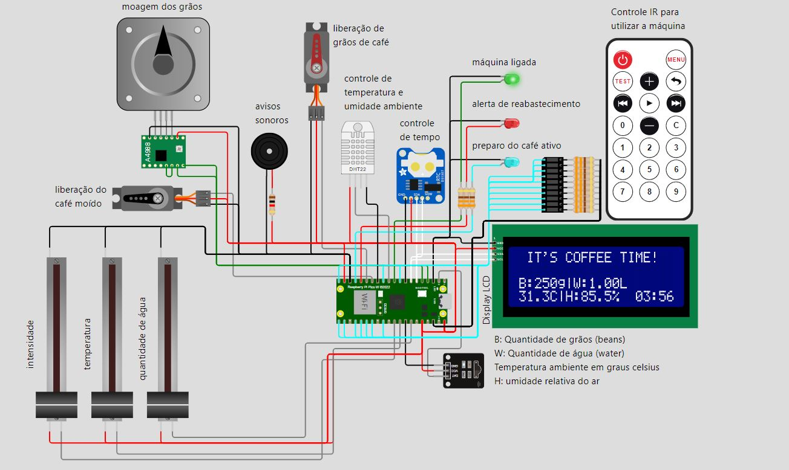
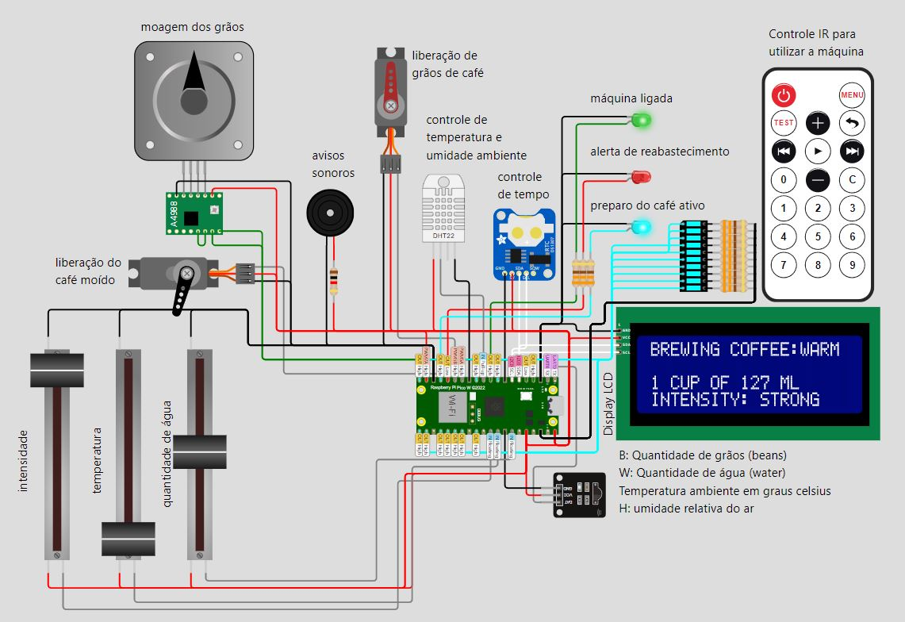
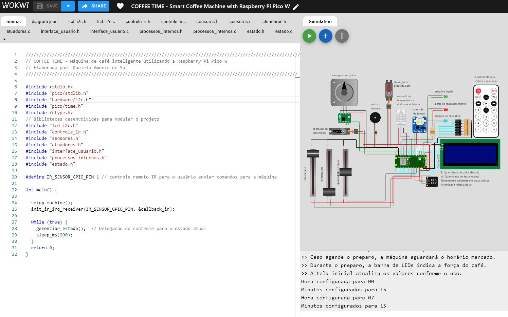

# Coffee Time - Smart Coffee Machine ☕  
**Projeto Final do Curso EmbarcaTech - Máquina de Café Inteligente utilizando Raspberry Pi Pico W**  

## Sobre o Projeto  
O Coffee Time é uma máquina de café inteligente desenvolvida como **projeto final do curso EmbarcaTech**, simulando o preparo de café personalizado com ajuste de intensidade, temperatura e quantidade. O sistema integra sensores e atuadores para monitoramento e controle, sendo totalmente simulado na plataforma [Wokwi](https://wokwi.com).  



## O que é o EmbarcaTech?  
O **EmbarcaTech** é um programa de capacitação profissional destinado a alunos de nível superior em Tecnologias da Informação e Comunicação (TIC) e áreas correlatas, com foco em **Sistemas Embarcados e Internet das Coisas (IoT)**. O programa é composto por:  
1. **Capacitação online inicial (3 meses)**: Abordagem de conceitos e desenvolvimento de projetos práticos em sistemas embarcados.  
2. **Residência Tecnológica (12 meses)**: Aplicação prática dos conhecimentos adquiridos em estudos de caso e projetos em áreas como educação, segurança, indústria e saúde.  

Esse projeto faz parte da primeira fase do programa, como exemplo prático de automação com IoT.  

---

## Principais funcionalidades:
- Monitoramento de temperatura e umidade do ambiente (sensor DHT22).  
- Ajuste personalizado de intensidade, temperatura e quantidade de café.
- Simulação de moagem e preparo do café 
- Preparo de café agendado ou imediato.  
- Indicação de status no display LCD e barra de LEDs.  
- Controle remoto para interação com a máquina.

  

---

## Componentes utilizados  
- **Raspberry Pi Pico W**  
- **Sensor DHT22** (Temperatura e Umidade)  
- **Motor de Passo**  
- **Servomotores**  
- **Buzzer**  
- **Display LCD I2C**  
- **Controle Remoto IR**
- **RTC (controle de tempo/agendamento)**
- **Potenciômetros lineares (ajuste de intensidade, temperatura e quantidade de água)**
- **LEDs indicativos e barra de LEDs (para exibir a intensidade da bebida)**

---

## Simulação  
Você pode acessar a simulação completa no Wokwi clicando [aqui](https://wokwi.com/projects/422226074874479617). 



---

## Como executar o Projeto  
1. Clone este repositório:  
   ```sh
   git clone https://github.com/seu-usuario/coffeetime.git
   ```
2. Abra o projeto no [Wokwi](https://wokwi.com) ou em seu ambiente de desenvolvimento local.
3. Compile e execute o código. Certifique-se de que todas as bibliotecas necessárias estejam disponíveis.

---

## Estrutura do Projeto  
```
📂 CoffeeTime-Maquina_de_Cafe_Inteligente
├── main.c                       → Função principal e loop de controle
├── sensores.h / sensores.c       → Leitura de ADC, DHT22, RTC e verificação de recursos
├── atuadores.h / atuadores.c     → Controle dos servomotores, motor de passo e LEDs
├── interface_usuario.h / interface_usuario.c → Exibição de menus, telas e interação com o usuário
├── estado.h / estado.c           → Transição e gerenciamento dos estados da máquina
├── controle_ir.h / controle_ir.c → Tratamento de eventos do controle IR
└── lcd_i2c.h / lcd_i2c.c         → Controle do display LCD
```

- **main.c**: Função principal do projeto, responsável pelo loop principal e inicialização do sistema.
- **estado.c / estado.h**: Gerenciamento dos estados da máquina de café.
- **interface_usuario.c / interface_usuario.h**: Exibição de menus e interação com o usuário.
- **processos_internos.c / processos_internos.h**: Configuração inicial e lógica interna do preparo do café.
- **atuadores.c / atuadores.h**: Controle dos LEDs, servomotores, motor de passo e buzzer.
- **sensores.c / sensores.h**: Leitura e processamento de dados dos sensores.
- **controle_ir.c / controle_ir.h**: Controle e interpretação de comandos do controle remoto IR.
- **lcd_i2c..c / lcd_i2c.h:** Controle do display LCD

---

## 📖 Documentação completa
A documentação detalhada do projeto está disponível no PDF a seguir:
[📄 CoffeeTime - Documentação Completa](PROJETO FINAL.pdf)

---
## 📄 Licença
Este projeto está sob a licença MIT. Veja o arquivo [LICENSE](LICENSE) para mais detalhes.

---
## Autora  
**Daniela Amorim de Sá**  
Engenheira Eletrônica | Sistemas Embarcados e IoT  
Projeto desenvolvido como parte do curso EmbarcaTech.  

